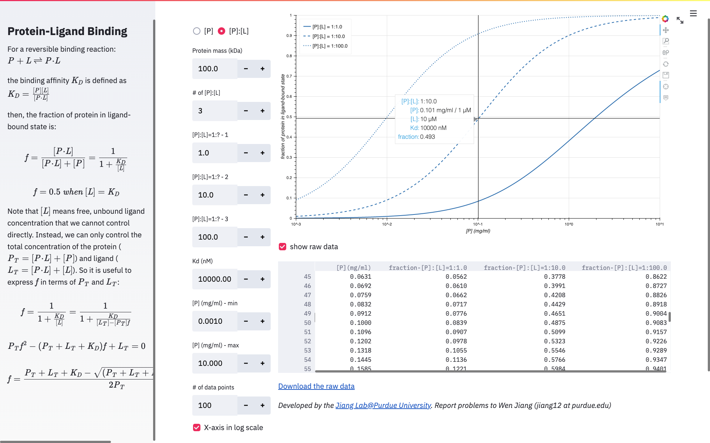

# Protein Ligand Binding
This Web app provides interactive online simulation of the fraction of protein molecules in ligand-bound state as a function of binding affinity, protein concentration, and ligand concentration.

Click one of these hosting links (<a href="https://share.streamlit.io/wjiang/protein-ligand-binding">Host 1</a> | <a href="https://protein-ligand-binding.herokuapp.com">Host 2</a>) to show the protein-ligand binding curves!</a>

