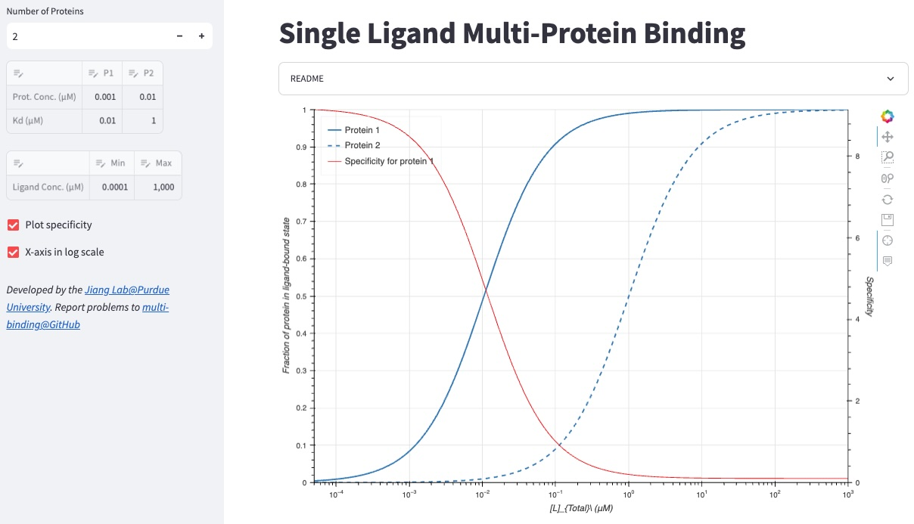

# Multi-protein Ligand Binding
It is common for a ligand to bind to multiple proteins with different affinities. For example, a drug can bind its true target with a high affinity and many off-targets with weaker affinities. Here, we have developed a web app that can help you simulate these situations by plotting the fraction of the proteins in the bound state for any number of proteins, concentrations, and binding affinities.

Click the link below to show how multiple proteins compete for binding to a ligand!

<a href="https://multi-binding.streamlit.app">Web App</a>

